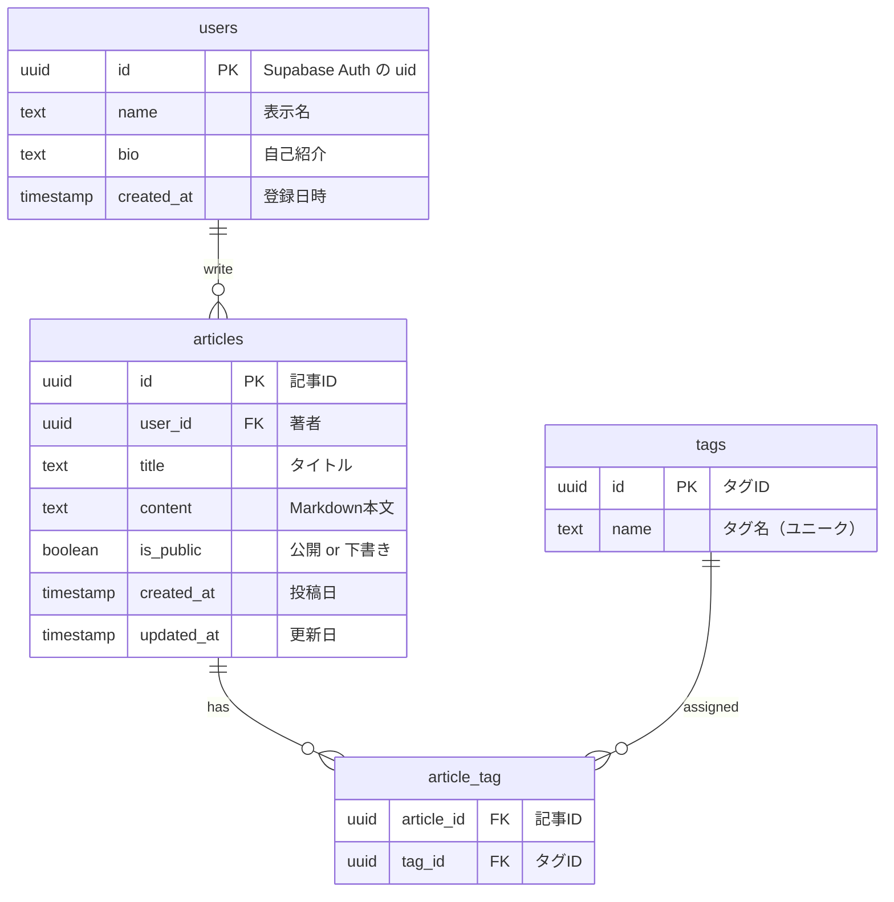

# ER 図 (生成 AI と共に作成)

```mermaid
erDiagram
%% ============================
%% Users
%% ============================
users {
    uuid id PK "Supabase Auth の uid"
    text name "表示名"
    text bio "自己紹介"
    timestamp created_at "登録日時"
}

%% ============================
%% Articles
%% ============================
articles {
    uuid id PK "記事ID"
    uuid user_id FK "著者"
    text title "タイトル"
    text content "Markdown本文"
    boolean is_public "公開 or 下書き"
    timestamp created_at "投稿日"
    timestamp updated_at "更新日"
}

%% ============================
%% Tags
%% ============================
tags {
    uuid id PK "タグID"
    text name "タグ名（ユニーク）"
}

%% ============================
%% Article_Tag (多対多)
%% ============================
article_tag {
    uuid article_id FK "記事ID"
    uuid tag_id FK "タグID"
}

%% ============================
%% リレーション
%% ============================
users ||--o{ articles : "write"
articles ||--o{ article_tag : "has"
tags ||--o{ article_tag : "assigned"

```
