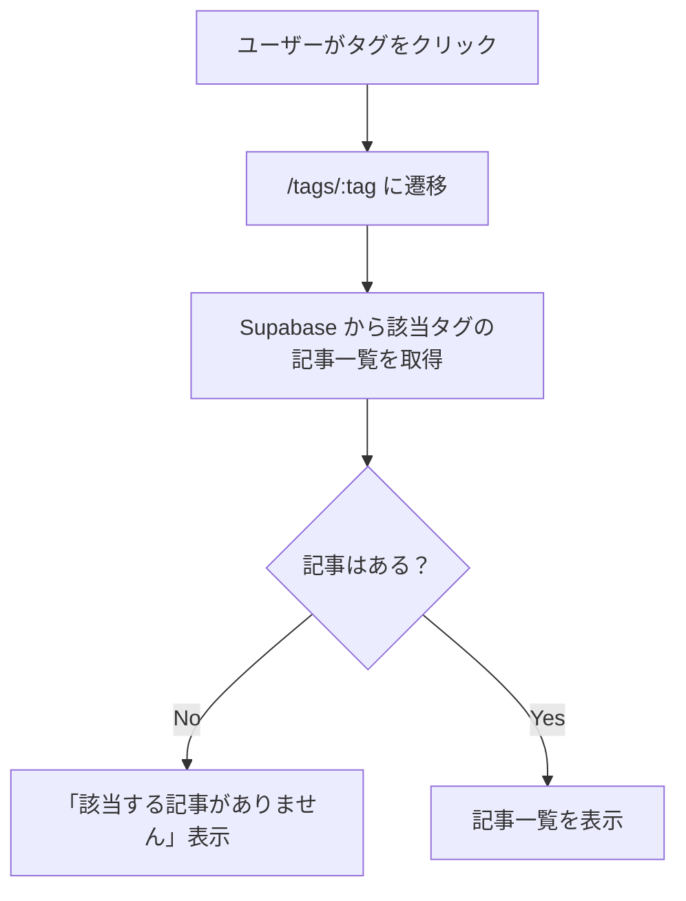

# フローチャート タグによる記事絞り込み (生成 AI と共に作成)

```mermaid
flowchart TD
  A[ユーザーがタグをクリック] --> B["/tags/:tag に遷移"]
  B --> C[Supabase から該当タグの記事一覧を取得]

  C --> D{記事はある？}
  D -->|No| E[「該当する記事がありません」表示]
  D -->|Yes| F[記事一覧を表示]

```
