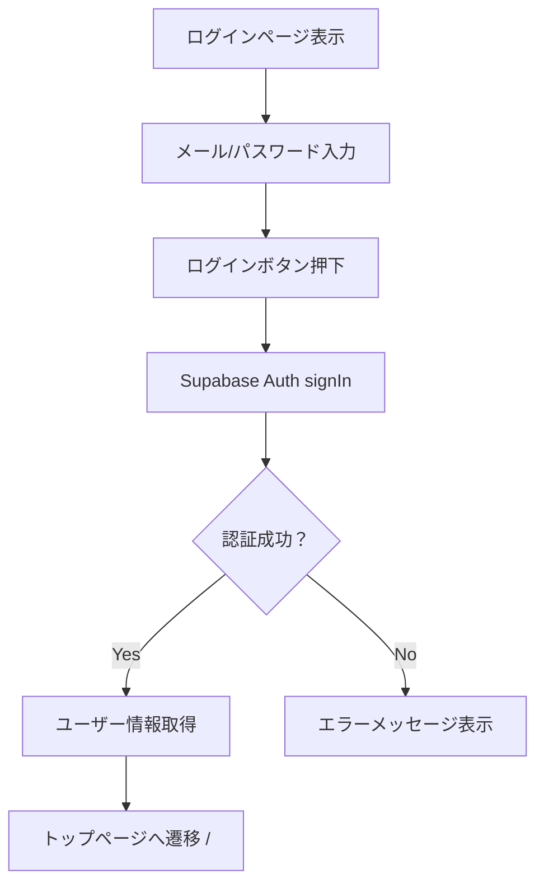

# フローチャート ログイン (生成 AI と共に作成)

```mermaid
flowchart TD
  A[ログインページ表示] --> B[メール/パスワード入力]
  B --> C[ログインボタン押下]

  C --> D[Supabase Auth signIn]
  D --> E{認証成功？}

  E -->|Yes| F[ユーザー情報取得]
  F --> G[トップページへ遷移 /]

  E -->|No| H[エラーメッセージ表示]

```
