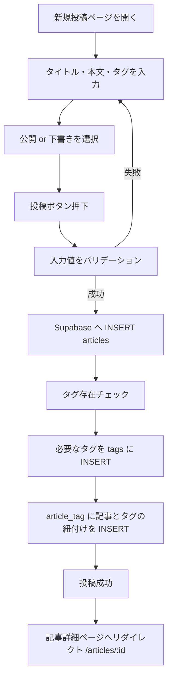

# フローチャート 新記事投稿 (生成 AI と共に作成)

```mermaid
flowchart TD
  A[新規投稿ページを開く] --> B[タイトル・本文・タグを入力]
  B --> C[公開 or 下書きを選択]
  C --> D[投稿ボタン押下]

  D --> E[入力値をバリデーション]
  E -->|成功| F[Supabase へ INSERT articles]
  E -->|失敗| B

  F --> G[タグ存在チェック]
  G --> H[必要なタグを tags に INSERT]
  H --> I[article_tag に記事とタグの紐付けを INSERT]

  I --> J[投稿成功]
  J --> K[記事詳細ページへリダイレクト /articles/:id]

```
