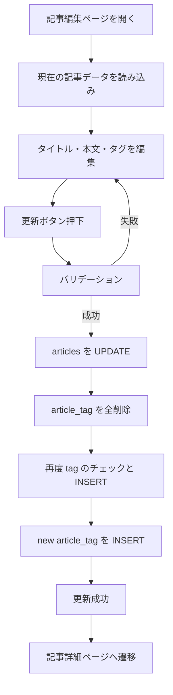

# フローチャート 記事編集 (生成 AI と共に作成)

```mermaid
flowchart TD
  A[記事編集ページを開く] --> B[現在の記事データを読み込み]
  B --> C[タイトル・本文・タグを編集]
  C --> D[更新ボタン押下]

  D --> E[バリデーション]
  E -->|成功| F[articles を UPDATE]
  E -->|失敗| C

  F --> G[article_tag を全削除]
  G --> H[再度 tag のチェックと INSERT]
  H --> I[new article_tag を INSERT]

  I --> J[更新成功]
  J --> K[記事詳細ページへ遷移]

```
