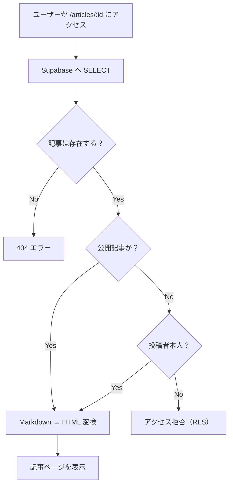

# フローチャート 記事閲覧（詳細表示） (生成 AI と共に作成)

```mermaid
flowchart TD
  A[ユーザーが /articles/:id にアクセス] --> B[Supabase へ SELECT]

  B --> C{記事は存在する？}
  C -->|No| Z[404 エラー]

  C -->|Yes| D{公開記事か？}

  D -->|Yes| E[Markdown → HTML 変換]
  D -->|No| F{投稿者本人？}

  F -->|No| Z2[アクセス拒否（RLS）]
  F -->|Yes| E[Markdown → HTML 変換]

  E --> G[記事ページを表示]

```
