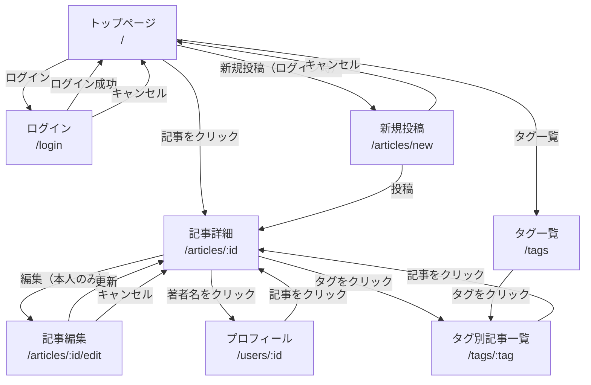

# 画面遷移図 (生成 AI と共に作成)

```mermaid
flowchart TD
  %% ============================
  %% Top Page
  %% ============================
  A[トップページ<br>/] -->|記事をクリック| B[記事詳細<br>/articles/:id]
  A -->|ログイン| L[ログイン<br>/login]
  A -->|新規投稿（ログイン時）| C[新規投稿<br>/articles/new]
  A -->|タグ一覧| T[タグ一覧<br>/tags]

  %% ============================
  %% 記事詳細
  %% ============================
  B -->|編集（本人のみ）| E[記事編集<br>/articles/:id/edit]
  B -->|著者名をクリック| U[プロフィール<br>/users/:id]
  B -->|タグをクリック| T_TAG[タグ別記事一覧<br>/tags/:tag]

  %% ============================
  %% 新規投稿・編集
  %% ============================
  C -->|投稿| B
  C -->|キャンセル| A

  E -->|更新| B
  E -->|キャンセル| B

  %% ============================
  %% プロフィール
  %% ============================
  U -->|記事をクリック| B

  %% ============================
  %% タグ関連
  %% ============================
  T -->|タグをクリック| T_TAG
  T_TAG -->|記事をクリック| B

  %% ============================
  %% Login
  %% ============================
  L -->|ログイン成功| A
  L -->|キャンセル| A

```
